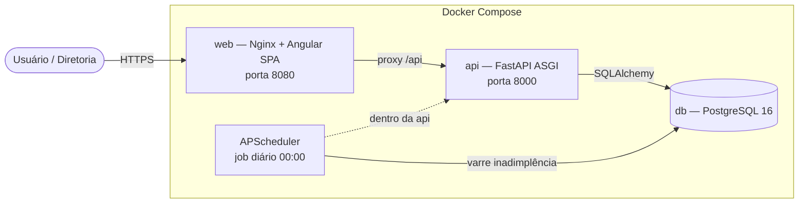
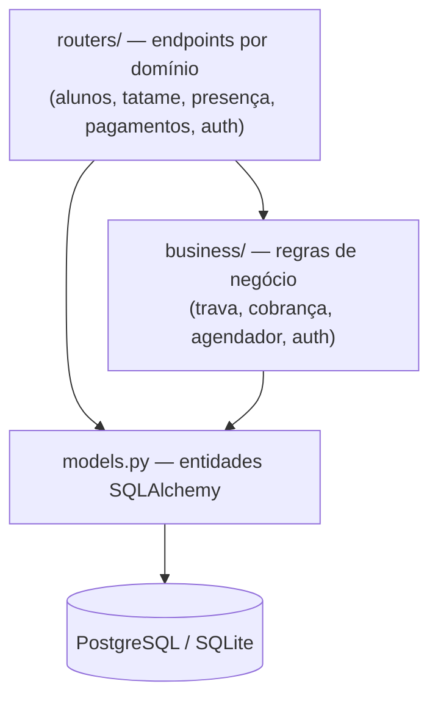
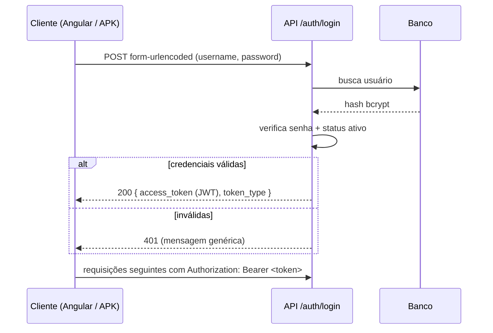

# Arquitetura — Yōkai no Ki SGI

Este documento descreve a arquitetura do sistema e os fluxos das principais
regras de negócio. Os diagramas usam [Mermaid](https://mermaid.js.org/), que o
GitHub renderiza nativamente.

## Visão geral (containers)



- O **Nginx** serve o build estático do Angular e faz proxy de `/api` para o
  serviço `api` — mesma origem, sem CORS no navegador.
- O **APScheduler** roda numa thread dentro do processo da API (não bloqueia a
  inicialização) e aplica a trava de inadimplência de forma proativa.

## Camadas do back-end



Princípio central: **a regra de negócio vive em `business/`, nunca duplicada nos
routers**. Ex.: a trava de inadimplência é uma função única
(`avaliar_trava_inadimplencia`) chamada tanto pelas rotas (avaliação sob demanda)
quanto pelo agendador diário.

## Fluxo de autenticação (OAuth2 password flow)



## Fluxo da trava de inadimplência

```mermaid
flowchart TD
    start["Avaliar aluno<br/>(rota ou job diário)"]
    plano{Plano == Mensalidade?}
    acordo{Observação tem [ACORDO]?}
    atraso{hoje > vencimento + 5 dias?}
    trava["Status → Trancado<br/>prefixo [TRAVA AUTOMÁTICA]<br/>encerra sessão aberta"]
    emdia{Estava trancado por trava<br/>e voltou a ficar em dia?}
    reverte["Status → Ativo<br/>remove prefixo"]
    fim([Fim])

    start --> plano
    plano -->|Não| fim
    plano -->|Sim| acordo
    acordo -->|Sim → bypass| fim
    acordo -->|Não| atraso
    atraso -->|Sim| trava --> fim
    atraso -->|Não| emdia
    emdia -->|Sim| reverte --> fim
    emdia -->|Não| fim
```

## Hierarquia de cobrança por sessão

Ao encerrar uma sessão, o tempo vira horas decimais e o custo depende do plano:

| Plano | Fórmula | Observação |
| --- | --- | --- |
| Hora Flexível | `horas × valor_base` | ignora franquia |
| Mensalidade | `(horas − 3) × valor_base` | franquia de 3h; custo nunca negativo |
| Intensivão | `horas × valor_base × 1.5` | acréscimo de 50% |
| Horas Livres | `horas × valor_base` | — |

Descontos são aplicados após o cálculo, e o resultado é sempre `≥ 0`.
